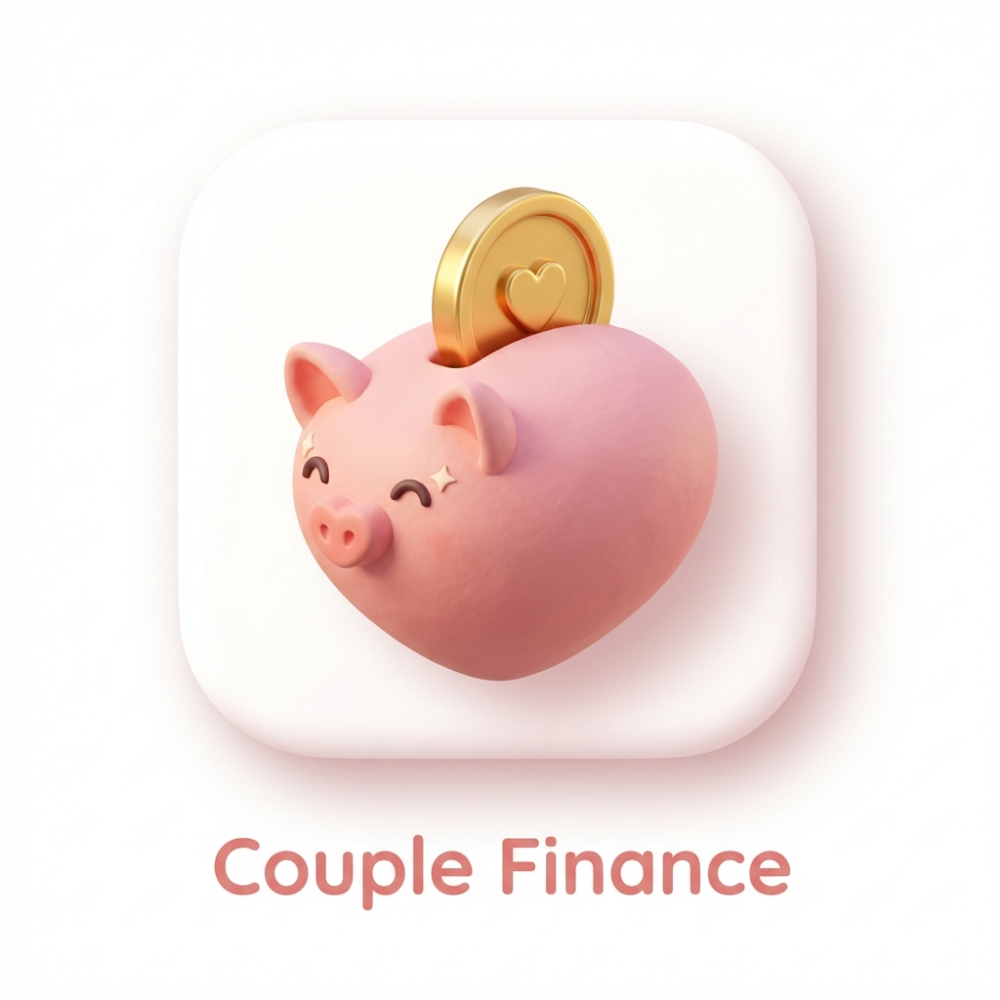
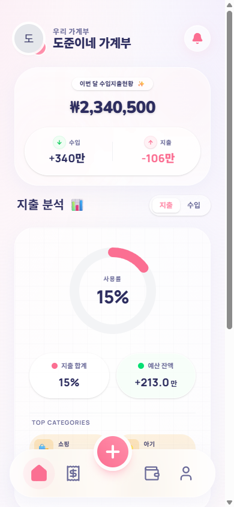
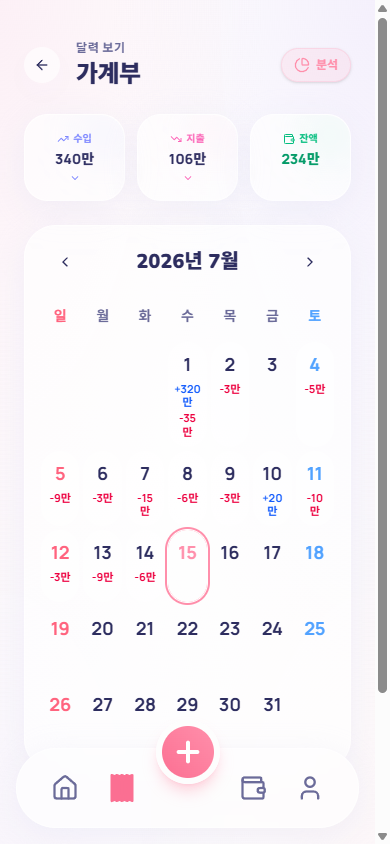
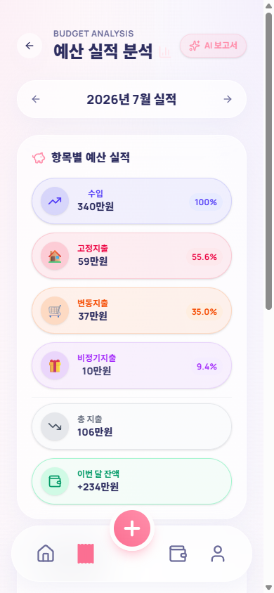
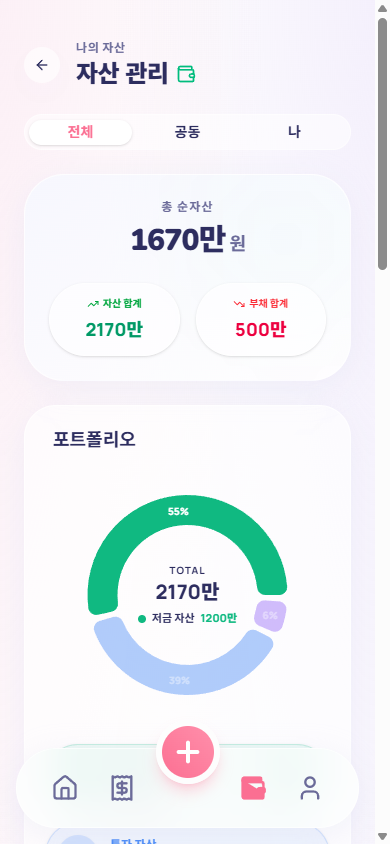
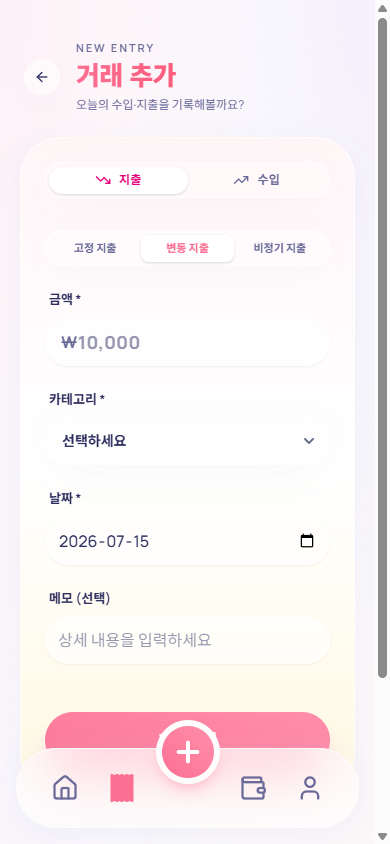
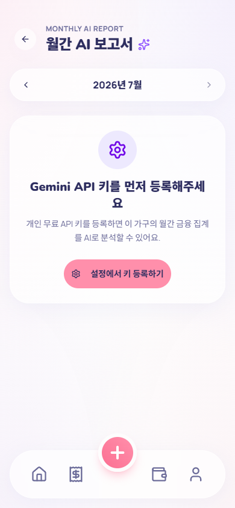

<div align="center">



# 부부 공동 가계부 (Couple Finance)

**함께 관리하는 똑똑한 자산 관리**

둘이 쓰는 돈, 이제 한 곳에서 투명하게.
부부가 함께 기록하고, 함께 보고, AI가 매달 분석해주는 모바일 가계부입니다.

[](https://nextjs.org)
[](https://www.typescriptlang.org)
[](https://supabase.com)
[](https://couple-finance-roan.vercel.app)
[](https://couple-finance-roan.vercel.app)

**[🚀 지금 사용해보기](https://couple-finance-roan.vercel.app)** · **[📖 사용법 가이드](docs/USAGE.md)**

</div>

---

## 왜 부부 공동 가계부인가요?

혼자 쓰는 가계부는 많지만, **부부가 함께 쓰는** 가계부는 드뭅니다.
"이번 달 우리 얼마 썼지?"를 카톡으로 묻는 대신, 두 사람이 같은 가계부에 기록하고 같은 화면을 봅니다.

| 핵심 가치 | 설명 |
|---|---|
| 🪟 **투명성** | 부부의 수입·지출·자산을 한 곳에서 공유 |
| 🤝 **협업** | 둘 다 언제든 입력·수정 — 초대 코드 하나로 연결 |
| 📱 **접근성** | 설치형 PWA — 앱스토어 없이 홈 화면에 바로 설치 |
| 🔒 **보안성** | 가구(부부) 단위 데이터 격리 (Supabase RLS) — 다른 가구는 절대 열람 불가 |

## 주요 기능

### 📅 달력으로 보는 한 달 가계부
리스트가 아닌 **월간 달력**이 기본 화면. 날짜마다 수입·지출이 표시되고, 날짜를 누르면 그날 내역을 바로 보고 입력할 수 있습니다.

### 💸 고정 · 변동 · 비정기 지출 구분
월세·통신비 같은 **고정 지출**, 식비·쇼핑 같은 **변동 지출**, 경조사비 같은 **비정기 지출**을 구분해 기록 — "이번 달 진짜 아낄 수 있는 돈"이 보입니다.

### 📊 예산 실적 분석
월 예산을 정해두면 항목별 실적과 사용률을 자동 집계. 매달 반복되는 거래는 **거래 복사**로 한 번에 입력합니다.

### 💰 자금 흐름과 자산을 분리해서 관리
매달의 수입·지출(Flow)과 모아둔 자산(Stock)을 분리. 예금·투자·현금·부채를 등록하면 **포트폴리오 도넛 차트**와 **순자산 추이 그래프**가 자동으로 그려지고, 자산을 수정할 때마다 일별 스냅샷이 기록됩니다.

### 🤖 AI 월간 보고서
한 달 가계부를 AI(Google Gemini)가 분석해 **한 줄 총평, 전월 대비 변화, 예산 피드백, 절약 팁, 칭찬 포인트**를 담은 보고서를 만들어줍니다. 본인의 무료 API 키를 등록해서 사용하므로 추가 비용이 없습니다.

### 📲 앱처럼 설치 (PWA)
앱스토어 없이 브라우저에서 홈 화면에 추가하면 앱처럼 실행됩니다.

## 스크린샷

| 대시보드 | 달력 가계부 | 예산 실적 분석 |
|:---:|:---:|:---:|
|  |  |  |

| 자산 포트폴리오 | 거래 입력 | AI 월간 보고서 |
|:---:|:---:|:---:|
|  |  |  |

## 시작하기

1. **[couple-finance-roan.vercel.app](https://couple-finance-roan.vercel.app)** 접속 → 이메일로 회원가입
2. **가구 만들기** → 생성된 8자리 초대 코드를 배우자에게 전달
3. 배우자는 회원가입 후 **가구 참여하기**에 초대 코드 입력 — 끝!

처음 쓰는 분을 위한 화면별 안내는 **[사용법 가이드 (docs/USAGE.md)](docs/USAGE.md)** 를 참고하세요.

## 기술 스택

| 영역 | 기술 |
|---|---|
| 프론트엔드 | Next.js (App Router) · React 19 · TypeScript · Tailwind CSS · shadcn/ui |
| 차트/애니메이션 | Recharts · framer-motion |
| 백엔드 | Supabase (PostgreSQL · Auth · RLS · RPC) |
| AI | Google Gemini API (사용자 개인 무료 키, 구조화 JSON 응답) |
| 배포 | Vercel (git push 자동 배포) · PWA |

## 개발자용: 로컬 실행

```bash
npm install
# .env.local에 NEXT_PUBLIC_SUPABASE_URL, NEXT_PUBLIC_SUPABASE_ANON_KEY 설정
npm run dev
```

```
app/(auth)/      로그인 · 회원가입 · 온보딩(가구 생성/참여)
app/(app)/       대시보드 · 가계부(달력/분석) · AI 보고서 · 자산 · 설정 · 관리자
components/      화면 컴포넌트 (charts, reports, admin, settings, ui …)
lib/             서버 액션 · Supabase 클라이언트 · 검증/집계 유틸
supabase/        DB 마이그레이션 (Dashboard SQL Editor에서 수동 적용)
```

---

<div align="center">

Made with ♥ by 도준파더 · © 2026 Couple Finance

</div>
