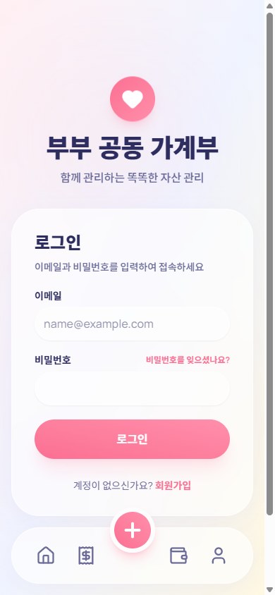
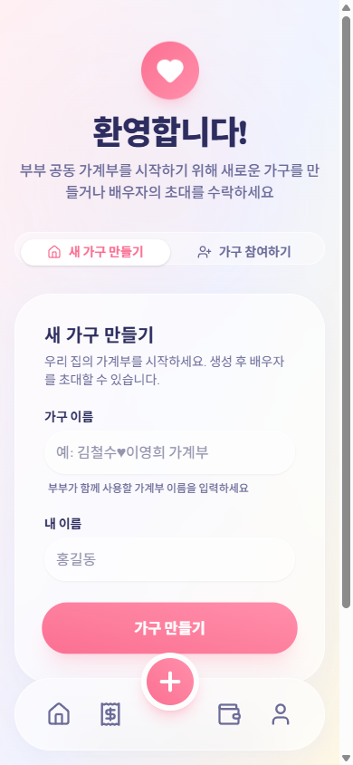

# 부부 공동 가계부 — 사용법 가이드

처음 쓰는 부부를 위한 단계별 안내입니다. 5분이면 둘이 함께 쓰는 가계부가 완성됩니다.

> 🌐 앱 주소: **https://couple-finance-roan.vercel.app**

## 목차

1. [회원가입 · 로그인](#1-회원가입--로그인)
2. [가구 만들기 & 배우자 초대](#2-가구-만들기--배우자-초대)
3. [거래 입력하기](#3-거래-입력하기)
4. [달력으로 한 달 보기](#4-달력으로-한-달-보기)
5. [예산 설정과 실적 분석](#5-예산-설정과-실적-분석)
6. [자산 관리](#6-자산-관리)
7. [AI 월간 보고서](#7-ai-월간-보고서)
8. [홈 화면에 앱 설치 (PWA)](#8-홈-화면에-앱-설치-pwa)
9. [자주 묻는 질문](#9-자주-묻는-질문)

---

## 1. 회원가입 · 로그인

- 앱 접속 → **회원가입** → 이메일과 비밀번호(6자 이상) 입력.
- 이미 계정이 있으면 로그인 화면에서 바로 로그인합니다.
- 비밀번호를 잊었다면 로그인 화면의 **"비밀번호를 잊으셨나요?"** 로 재설정할 수 있습니다.

## 2. 가구 만들기 & 배우자 초대

가입 직후 온보딩 화면이 나타납니다. 부부 중 **한 명만** 가구를 만들면 됩니다.

**첫 번째 사람 (가구 만들기)**
1. **"새 가구 만들기"** 탭에서 가구 이름(예: "도준이네 가계부")과 내 이름 입력 → 가구 만들기.
2. 만든 뒤 **설정 탭**에 가면 8자리 **초대 코드**가 보입니다 (복사 버튼 지원).

**두 번째 사람 (가구 참여하기)**
1. 회원가입 후 온보딩에서 **"가구 참여하기"** 탭 선택.
2. 배우자에게 받은 초대 코드와 내 이름 입력 → 참여 완료.

> 💡 가구는 최대 2명(부부)으로 구성됩니다. 두 명이 모두 참여하면 초대 코드는 더 이상 표시되지 않습니다.

## 3. 거래 입력하기

하단 가운데 **➕ 버튼**을 누르면 거래 입력 화면이 열립니다.

- **수입 / 지출** 탭을 먼저 선택합니다.
- 지출은 세 가지로 구분해 기록합니다:
  - **고정 지출** — 월세·관리비·통신비·보험료처럼 매달 나가는 돈
  - **변동 지출** — 식비·외식·쇼핑·교통처럼 노력하면 줄일 수 있는 돈
  - **비정기 지출** — 경조사비·세금·대형 구매처럼 가끔 나가는 돈
- 금액·카테고리·날짜를 입력하고 필요하면 메모를 남깁니다.
- 처음 사용할 때 기본 카테고리가 자동으로 만들어지며, **설정 → 카테고리**에서 추가·수정할 수 있습니다.

> 💡 **거래 복사**: 매달 반복되는 거래(월세, 구독료 등)는 기존 거래의 ⋮ 메뉴에서 **복사**를 누르면 금액·카테고리·메모가 채워진 입력 화면이 열립니다.

## 4. 달력으로 한 달 보기

하단 두 번째 **가계부 탭**은 월간 달력이 기본 화면입니다.

- 날짜마다 그날의 수입(+파랑)·지출(-분홍) 합계가 표시됩니다.
- **날짜를 누르면** 그날의 거래 목록이 열리고, 바로 추가·수정·삭제할 수 있습니다.
- 상단의 수입/지출 카드를 누르면 카테고리별 상세 내역이 펼쳐집니다.
- 좌우 화살표로 다른 달로 이동합니다.

## 5. 예산 설정과 실적 분석

**예산 설정**: 설정 탭 → **예산 설정**에서 이번 달 총 예산을 입력합니다. 대시보드의 사용률 게이지가 이 예산을 기준으로 움직입니다.

**실적 분석**: 달력 화면 오른쪽 위 **분석** 버튼을 누르면 항목별 실적이 보입니다.

- 수입 / 고정지출 / 변동지출 / 비정기지출별 금액과 비율
- 항목을 누르면 해당 거래 목록 확인
- 이번 달 잔액(수입 − 지출) 요약

## 6. 자산 관리

하단 세 번째 **자산 탭**에서 모아둔 돈을 관리합니다. 가계부(매달의 흐름)와 자산(쌓인 재산)은 분리되어 있습니다.

- **자산 추가**: 저금·투자·현금·자녀 자산·부채 유형으로 등록. 소유 구분(공동/개인/자녀)도 지정할 수 있습니다.
- **포트폴리오**: 자산 구성이 도넛 차트로 표시됩니다. 조각을 누르면 상세 금액이 보입니다.
- **자산 변동 기록**: 자산을 추가하거나 금액을 수정할 때마다 그날의 순자산이 자동 기록되어 추이 그래프가 그려집니다. 1/3/6개월·전체 기간으로 볼 수 있습니다.

> 💡 정확한 추이를 위해 **월급일이나 월말에 각 자산의 현재 잔액을 업데이트**해주세요. 예금 잔액 수정, 투자 수익 반영 등.

## 7. AI 월간 보고서

한 달 가계부를 AI가 분석해 총평·전월 대비 변화·예산 피드백·절약 팁·칭찬 포인트를 만들어줍니다. **본인의 무료 Google Gemini API 키**로 동작하므로 비용이 들지 않습니다.

**① 무료 API 키 발급 (1회)**
1. [Google AI Studio](https://aistudio.google.com) 접속 → 구글 계정 로그인
2. **Get API key** → **API 키 만들기** → 생성된 키 복사

**② 앱에 키 등록 (1회)**
1. **설정 탭 → AI 보고서 키** → 복사한 키 붙여넣기 → 저장
2. 키는 서버에서만 사용되며 화면에는 마지막 4자리만 표시됩니다.

**③ 보고서 생성**
1. **가계부 탭 → 분석** → 오른쪽 위 **AI 보고서** 버튼
2. **보고서 생성** 버튼을 누르면 10~30초 뒤 완성됩니다. 같은 달 보고서는 언제든 **다시 생성**할 수 있습니다.

## 8. 홈 화면에 앱 설치 (PWA)

앱스토어 없이 브라우저에서 바로 설치합니다.

- **Android (Chrome)**: 설정 탭 하단의 **앱 설치** 버튼을 누르거나, 브라우저 메뉴(⋮) → "홈 화면에 추가"
- **iPhone (Safari)**: 공유 버튼(⬆︎) → **"홈 화면에 추가"**

설치하면 전체 화면 앱처럼 실행되고 홈 화면 아이콘으로 바로 접속됩니다.

## 9. 자주 묻는 질문

**Q. 초대 코드가 안 보여요.**
가구에 이미 2명이 참여한 상태입니다. 초대 코드는 배우자가 아직 참여하지 않았을 때만 설정 탭에 표시됩니다.

**Q. AI 보고서가 안 만들어져요.**
① 설정에 Gemini API 키가 등록돼 있는지, ② 해당 월에 거래 기록이 있는지 확인하세요. "무료 사용량 한도" 메시지가 나오면 잠시(약 1분) 후 다시 시도하거나 [Google AI Studio](https://aistudio.google.com)에서 프로젝트 한도를 확인하세요.

**Q. 지난달 가계부를 수정할 수 있나요?**
네. 달력에서 이전 달로 이동해 날짜를 누르면 추가·수정·삭제 모두 가능합니다.

**Q. 부부가 동시에 입력해도 되나요?**
네. 두 사람의 입력이 같은 가계부에 실시간 반영됩니다. 대시보드의 활동 기록에서 누가 무엇을 입력했는지 확인할 수 있습니다.

**Q. 데이터는 안전한가요?**
모든 데이터는 가구(부부) 단위로 격리되어(RLS) 다른 가구는 열람할 수 없습니다. AI 분석 시에도 거래 메모는 전송하지 않고 카테고리별 집계만 사용합니다.

---

문의·건의는 앱의 **설정 → 고객 지원 → 문의하기**로 보내주세요. 답변은 "내 문의함"에서 확인할 수 있습니다.
